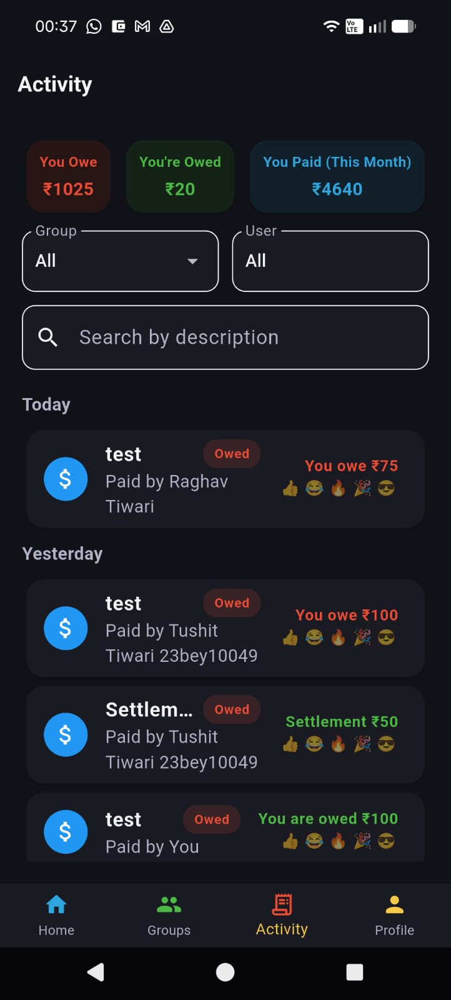

<div align="center">
  

  # 💸 Spendy

  **Your ultimate companion for splitting bills, tracking expenses, and settling up gracefully!**

  [](https://flutter.dev/)
  [](https://firebase.google.com/)
  [](https://dart.dev)
  
  *Say goodbye to awkward money conversations and complicated math.*

  ### 📱 [Download Spendy App (APK)](https://drive.google.com/file/d/1jlpMeYIIADIxfdLdjCm1qlfRX7wLfQvI/view?usp=sharing)

</div>

---

## ✨ Features

- **Split Expenses Seamlessly:** Create groups with friends, family, or roommates and add expenses on the go.
- **Smart Balances:** Instantly see who owes whom with automatically simplified debts and real-time net balances.
- **Settle Up:** Clean, intuitive flows to record payments and wipe out debts gracefully.
- **Comprehensive Analytics:** Visualize your spending habits with interactive charts & graphs powered by `fl_chart`.
- **Real-time Synchronization:** Built on Firebase Firestore for instantaneous updates across all devices.
- **Secure Authentication:** Secure and quick login using Google Sign-In and Firebase Auth.
- **Push Notifications:** Never miss an update when an expense is added, updated, or settled up.
- **Media & Receipts:** Attach receipt images using `image_picker` and `firebase_storage`.
- **Delightful UI:** Enjoy a premium, smooth, and stunning Flutter interface with micro-animations like Confetti!

---

## 📸 Screenshots

<div align="center">
  
  
  
</div>

---

## 🛠️ Tech Stack & Dependencies

**Spendy** is built using modern cross-platform technologies and a robust serverless backend:

*   **Frontend:** [Flutter](https://flutter.dev/) (Dart SDK ^3.8.1)
*   **Backend as a Service:** Firebase
    *   `firebase_auth` & `google_sign_in` - For reliable user authentication.
    *   `cloud_firestore` - For real-time NoSQL document storage.
    *   `firebase_storage` - For user avatars and receipt images.
    *   `firebase_messaging` & `cloud_functions` - For powerful push notification pipelines.
*   **UI / UX Goodies:**
    *   `fl_chart` - Beautiful, animated charts.
    *   `confetti` - For delightful settlement animations.
    *   `flutter_local_notifications` - On-device alerts.
    *   `share_plus` - Easily share group invite links or summaries.

---

## 🚀 Getting Started

Follow these steps to get a copy of Spendy up and running on your local machine for development and testing.

### Prerequisites

- [Flutter SDK](https://docs.flutter.dev/get-started/install) installed on your machine.
- A functional IDE such as [VS Code](https://code.visualstudio.com/) or [Android Studio](https://developer.android.com/studio).
- A Firebase project configured for Android/iOS.

### Installation

1. **Clone the repository:**
   ```bash
   git clone https://github.com/tushit24/Spendy_.git
   cd Spendy_
   ```

2. **Install Dependencies:**
   ```bash
   flutter pub get
   ```

3. **Firebase Configuration:**
   * Make sure to add your `google-services.json` (for Android) and `GoogleService-Info.plist` (for iOS) from your Firebase Console into the respective folders.
   * Review `FCM_SETUP_INSTRUCTIONS.md` for specific pushes and cloud functions setup.

4. **Run the App:**
   ```bash
   flutter run
   ```

---

## 🏗️ Project Structure

```text
lib/
├── main.dart             # Entry point & theme configuration
├── main_nav_screen.dart  # Core navigation architecture
├── services/             # Firebase integration (Auth, Firestore, Messaging)
├── models/               # Data structures (Expense, Group, User)
├── screens/              # UI Views (Home, Activity, Profile, Analytics)
├── widgets/              # Reusable UI components & cards
└── utils/                # Helpers, Formatters, & Settlement Logic
```

---

## 📄 License

This project is licensed under the MIT License.

---
<div align="center">
  <i>Built with ❤️ using Flutter and Firebase</i>
  <i>By Tushit Tiwari</i>  
</div>
